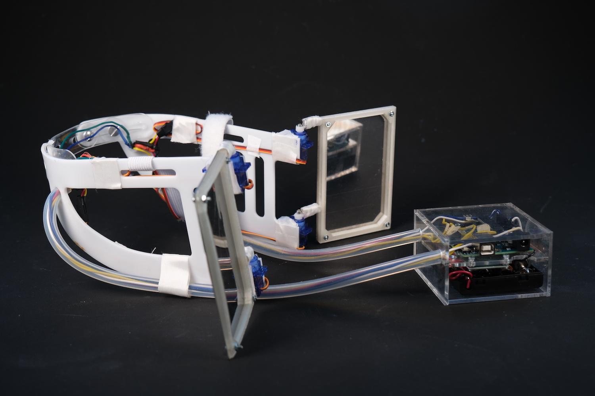

# 🗳️ Political Vision

**Political Vision** is a wearable installation that visualizes how news media can physically shape our political viewpoints.

---

## 💡 Concept

- News channels often shape public opinion by reinforcing specific perspectives.
- This project limits the wearer's **field of vision** based on the **news sources** they engage with online.
- A commentary on how biased media narrows how we see the world — literally.

---

## 🛠️ How It Works

- A **custom-built web interface** (HTML/CSS/JS) lets users explore news channels and search topics.
- When a user selects a news outlet, the choice is sent in real time to a local **Node.js server**.
- The Node.js server communicates with an **Arduino** via **serial communication**.
- The Arduino controls **servo motors** that physically adjust the field of vision by moving attached panels on a wearable device.
- A **gyroscope sensor** tracks the wearer's head rotation and feeds that data back into the control logic.
- The full system was hand-coded — from frontend to backend to microcontroller integration — to simulate media-driven perception shifts.

---

## 📄 More Info

🔗 Full documentation: [www.juliadaser.com/political-vision](http://www.juliadaser.com/political-vision)

---

## Image

